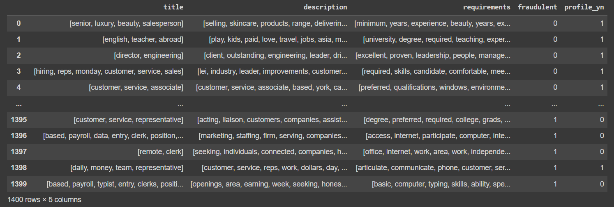
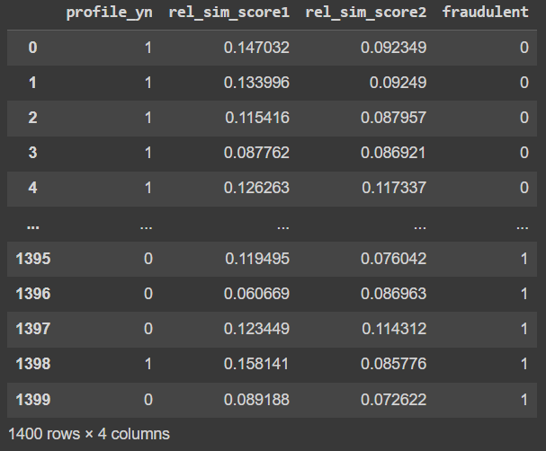
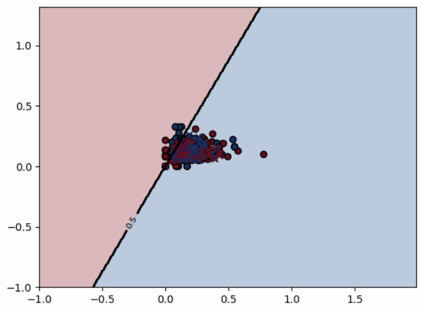
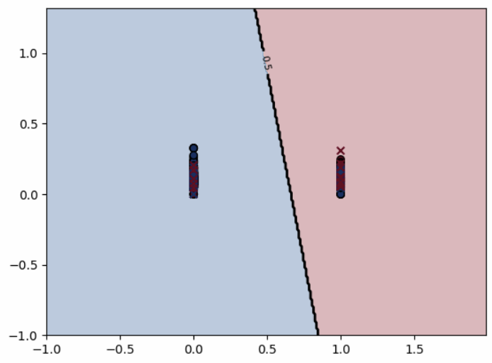
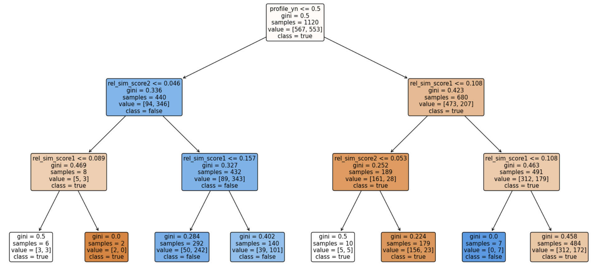
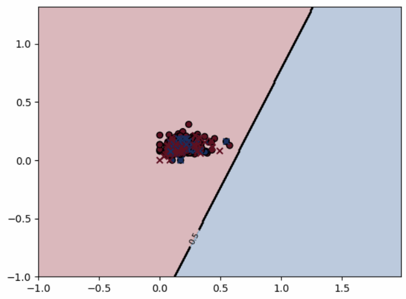
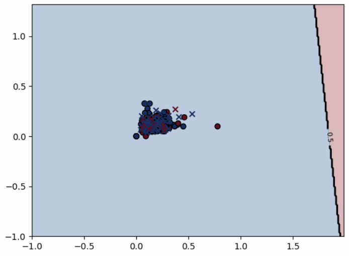
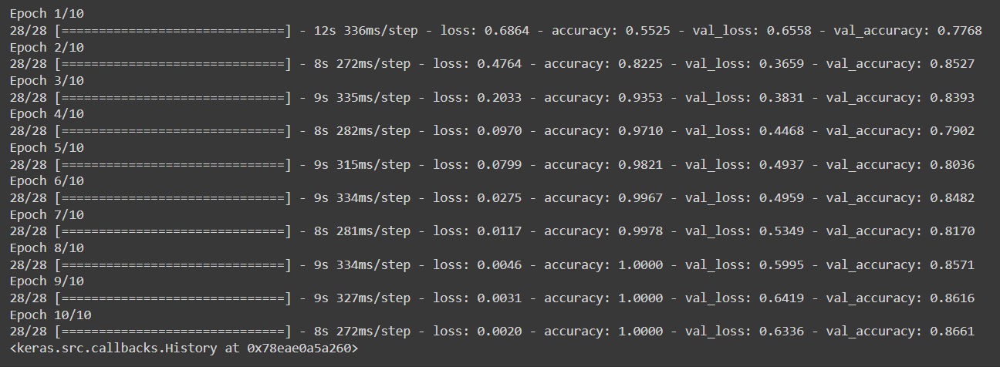

# Fake Job Listing Categorization using Various Data Analysis Models (LR, DT, NN)

**This project aims to discern between legitimate and fake job listings by testing different data analysis models. The job listing data is found on Kaggle and contains various data columns for numerous listings, both real and fake. The data is then pre-processed with Pandas and fed through a logistic regression model, decision tree model, and a LSTM model. The respective outputs and accuracies for each model are compared.**

## Periods of Development 
- December 5, 2023 - February 7, 2024

## Development Environment  
- 'Python 3.10'  
- Modules: Pandas, SKLearn, TensorFlow

## Core Features  

### Pre-Processing

The data set was obtained from Kaggle (https://www.kaggle.com/datasets/shivamb/real-or-fake-fake-jobposting-prediction), imported into Google Drive and mounted in Colab. The actual csv file and `kaggle.json` are included in the repo. The data includes job titles, job descriptions, requirements, location, salary ranges, company profile, etc; however, not all job listings have data for each column. Thus, only the job title, description, and requirements (the three columns with the most data), as well as only the listings that contain all such data will be used for data analysis. Furthermore, initial data inspection indicated a possible correlation between fake job listings and missing company profile data. Thus, columns indicating whether a listing contains a company profile (`profile_yn`), as well as whether the listing is fraudulent or not (`fraudulent`) are included.

The data set contains significantly more legitimate listings than fraudulent ones, with 14473 and 711 respectively. Thus, an equal number of each (`n=700`) are randomly sampled each time the code is run. The sampled dataframe is shown below.

 

### Logistic Regression Model

The first method of data analysis used is logistic regression, applied to quantitative correlation values between the data columns in various combinations. More specifically, we will iterate over each job listing and calculate correlation values between each column-group of words via word similarity, and use those final values for logistic regression. Correlation values will be found for (title/description) and (description/requirements) column-pairs as contextual observation indicated those pairs to be most relevant.

#### Vector Space Model (Word Associativity)

To quantify the correlation between two columns, 5 keywords will be selected by descending tf-idf order, and correlation between each keyword combination ($5 \times 5 = 25$ combinations) will be used in computation. With word association, often most unrelated word pairs yield similarly low (but positive) values, whereas correlated word pairs yield higher values. Thus, to emphasize higher correlation values, the square of each value will be summed up. The final value will be square rooted to minimize excessive value inflation while preserving relative final scores. The following equation denotes a similarity score for an arbitrary job listing, for two columns $c_1, c_2$.

$$S_{c_1, c_2} = \sqrt{\sum (sim(w_a, w_b))^2} \qquad (\forall w_a \in c_1, w_b \in c_2)$$

The correlation value between two words $sim(w_1, w_2)$ will be computed with the KeyedVectors class in the gensim module included with Colab, using the vector space model "word2vec-google-news-300" provided by Google. (Details about the model can be found [here](https://code.google.com/archive/p/word2vec/).)

The final computed similarity scores are shown below. Here, `rel_sim_score1` refers to (title/desc), and `rel_sim_score2` refers to (desc/req).

 

#### LR Model Results

Two logistic regression models were generated. The first model was trained with the two similarity scores as independent variables and the `fradulent` data as dependent variables. 80% of the data was used for training and 20% for testing, and the results are shown below as a scatterplot using `matplotlib`.

 

As is evident, the data is a mess; the distribution of data is not clearly distinguishable with the given independent variables. This results in a subsatisfactory model accuracy of 47.8%.

From the plot, it seemed as if using the two similarity scores yielded intermixed data points. Thus, a second model was trained using one of the similarity scores and `profile_yn`; for the former, `rel_sim_score2` was used as contextually it contained more relevant information, and the latter due to the initial human observation noted above. The results are shown below.

 

Although this model yielded an accuracy of 69.6%, the scatterplot indicates this value is misleading, as the data was only distinguished by `profile_yn`, with `rel_sim_score2` serving no practical purpose. Thus, both models did not produce satisfactory results, and thus another method of data analysis was required.

### Decision Tree Model

The previous logistic regresison model indicated `profile_yn` to be a key deciding factor, motivating the usage of decision trees for data analysis. A decision tree is a tree-like hierarchial struture that subdivides data based on subsequent conditions. In this case, the decision tree was trained on `sample_df` based on `profile_yn`, `rel_sim_score1`, and `rel_sim_score2` to determine the `fraudulent` value. The final tree depth was set at 3 after experimentation, to prevent overfitting of training data. A plot of the final model is displayed below. 

#### DT Model Results

 

The above results showcase a final accuracy of 70%, the highest score for various depth levels. This is admittedly a disappointing score; however, an intersting note is that the majority of the accuracy is once again determined by `profile_yn`, which became evident at `max_depth=1`, producing an accuracy of 65%. This indicated a potential method of first using a 1-depth decision tree to divide the data with `profile_yn`, then applying logistic regression to each branch.

### Decision + Logistic Regression

A similar process to training the previous logistic regression models was utilized for each branch. The result of the branch `profile_yn > 0.5` is displayed below. 

#### Model Results - Companies with Profiles (`profile_yn = 1`)

 

Although the results present a 69.82% accuracy, this is meaningless as the logistic regression model failed to meaningfully divide the data; all points are on the same side of the drawn division line. The branch `profile_yn <= 0.5` shows similar results. 

#### Model Results - Companies without Profiles (`profile_yn = 0`)

 

As evident, decision trees nor logistic regression seems to be able to meaningfully discern between legitimate and fraudulent job listings. Thus, we opted to take some time to think of different machine learning methods (besides the most basic ones) that would be able to succeed. 

### RNN - LSTM

After some research, we determined recurrent neural networks (RNN) to have the most potential to succeed. RNN is one of the two most commonly used neural networks, with the other being convolutioniary neural networks (CNN). Due to the nature of both, CNN is often used for processing image data and RNN for sequential data. As text data is sequential, we aim to use RNN to analyze and categorize the texts in 'description' into 0 or 1 for 'fraudulent'.

However, when processing data, RNN is only able to access adjacent data, and not data further away or processed before. Thus, while it is theoretically possible for RNN to learn long-term dependencies by backpropogating through time, in practice RNN struggles to handle them effectively due to the vanishing gradient problem. Thus an altered version of RNN will be used, known as Long Short Term Memory (LSTM), that is able to adequately perform backpropagation.

LSTM utilizes structures called memory cells to store information. The memory cells regulate the storage, updating, and deletion of information through various gates (input, forget, output), enabling LSTM to forget unncessary information and only retain what is needed. Thus LSTM demonstrates far better performance than RNN in fields such as NLP, speech recognition, and time series forecasting, where contextual information is crucial.

#### Data Manipulation

Further data manipulation was required to transform `sample_df` into a format suitable for LSTM application. In particular, data in each column for each job listing was tokenized and turned into a recurrent sequence. We will illustrate this process through an example. Let there be a text to be fed into the LSTM model as follows.

>"Mary had a little lamb."

The TensorFlow `Tokenizer` stores each token into a numpy array.

>["Mary", "had", "a", "little", "lamb"]

The `texts_to_sequences` method then iterates through the np array, appending each token into a running np array containing all previous tokens. The specific instance of that array is then appended to a new np array, named `X_train_seq`. 
<blockquote>
[  
&nbsp;&nbsp;&nbsp;&nbsp;["Mary"],  
&nbsp;&nbsp;&nbsp;&nbsp;["Mary", "had"],  
&nbsp;&nbsp;&nbsp;&nbsp;["Mary", "had", "a"],  
&nbsp;&nbsp;&nbsp;&nbsp;["Mary", "had", "a", "little"],  
&nbsp;&nbsp;&nbsp;&nbsp;["Mary", "had", "a", "little", "lamb"] 
]
</blockquote>

This recurrent sequence is used for LSTM training, to maintain contextual connections for both adjacent and far-away words, in line with the rationale for using the LSTM model. 

#### LSTM Model Generation

A TensorFlow Keras sequential model was generated with three layers. The first embedding layer receives the input words (`X_train_seq`) and only preserves the sequences with high adjacent contextual connections, reducing the output to 128 dimensions before sending data to the next LSTM layer, which further reduces the output to 64 dimensions. The final dense layer condenses the LSTM output to 1 dimension signifying the probability of fraudulence, determined through a sigmoid function. The model was compiled using a binary cross entropy loss function and Adam optimizer, and fitted using 10 epochs and a batch size of 32. 

#### LSTM Model Results

Multiple iterations of fitting the model yielded a general accuracy of 85%, with the displayed results showing a 86.6% accuracy. 

 

The LSTM model shows significant improvements in meaningful discernment between legitimate and fraudulent job listings over other, more basic methods of data analysis. Although an accuracy of over 90% would be optimal, the current result is still satisfactory, especially considering the atrocious results of previous attempts with logistic regression and decision trees. Perhaps an altered version of LSTM more suited for formal speech, or a different type of RNN model altogether would yield better results. This is an idea for a separate exploration for some other time. 

## Reference
- Christopher D. Manning et al., 2008, Introduction to Information Retrieval (8th Edition)
